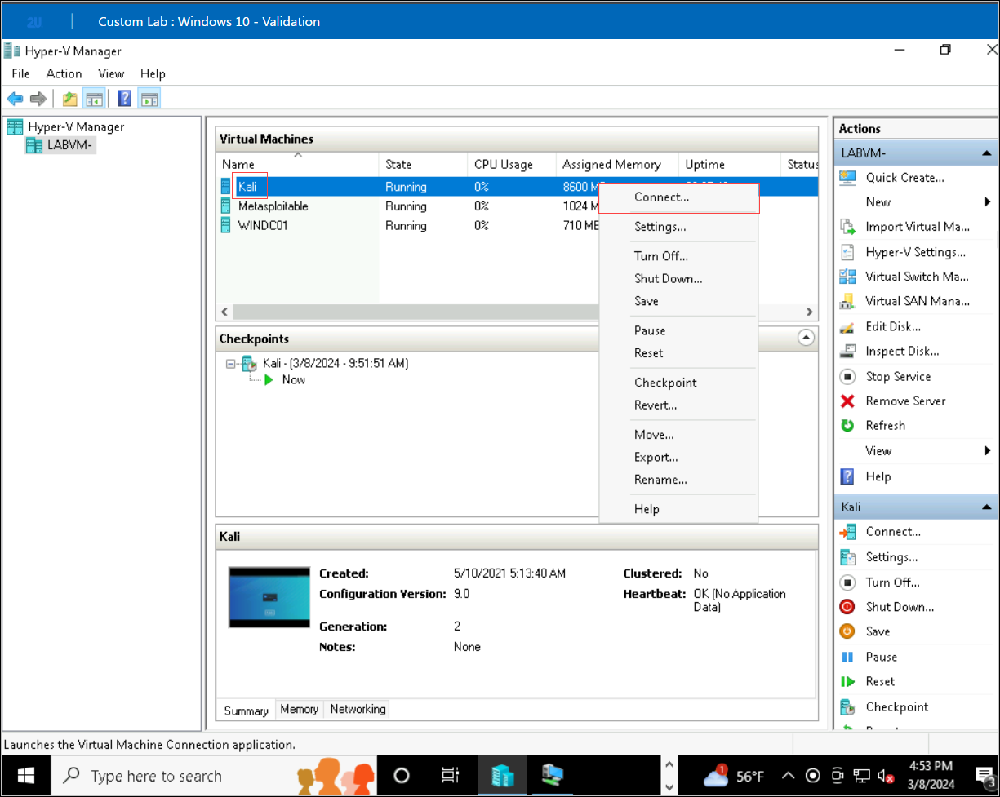
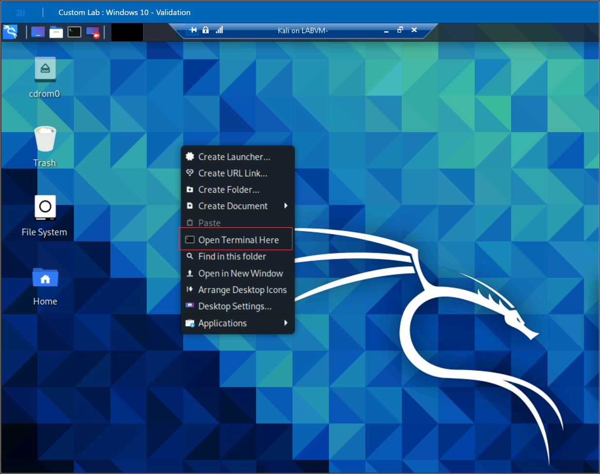
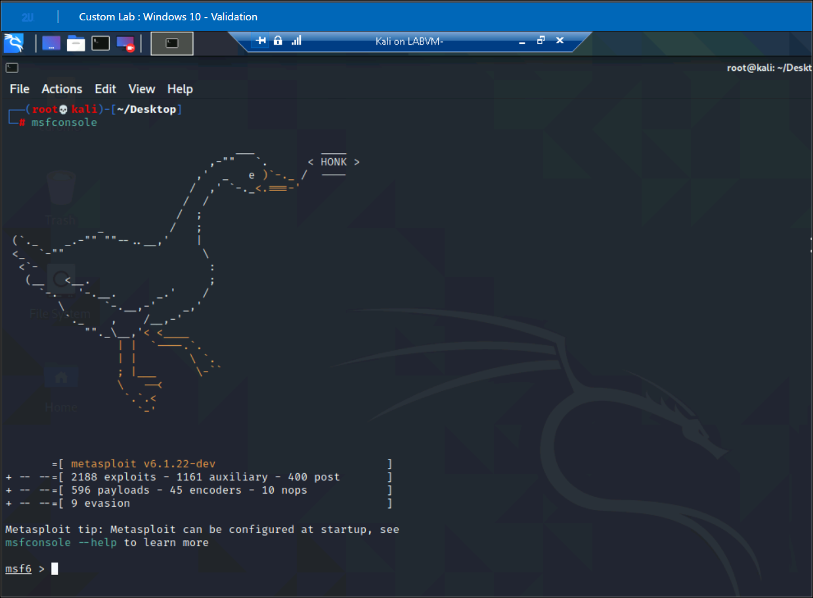

# Metasploit Demonstration

In this demonstration we will be going to perform following steps:

**Note**: Ensure that you do not miss running any of the commands mentioned in the steps below. If you fail to run any of the commands, the lab validation may fail.

1.  Open the Hyper-V Manager in your **LabVM** and right click on **Kali virtual machine** then click on **Connect** to connect to your **Kali virtual machine**.

    

    

    login to the Kali VM using username **root** and password **kali**.

2. On the Desktop of Kali VM, right click and choose **Open Terminal here**.

    

3. In the terminal enter **msfconsole** to launch msfconsole.

    

4. Enter the command **show auxiliary** to search for the all auxiliary modules.

    

5. Enter the command **search ftp/anonymous** to find the module **ftp/anonymous**.

    

6. Enter the command **use scanner/ftp/anonymous** to select the modlue.
7. To list the info about module enter the command **info**.

    

8. Enter the command **set RHOSTS 172.22.117.150** to set the RHOSTS value to the remote host's IP address.

    

9. Enter command **exploit** to launch the module.

    

11. Enter command **exit** to exit from the MSFConsole.

# Validation 1: Complete the execution of the auxiliary module

<validation step="f91e5325-de96-4dd5-99c9-6f9f3e9e6314" />
